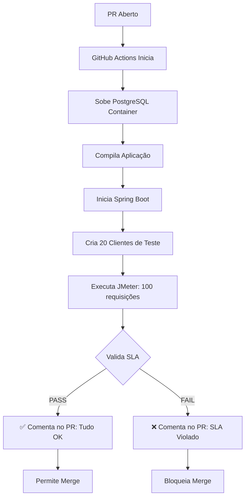

# ❓ FAQ - Testes de Performance com JMeter

## 🎯 Suas Perguntas Respondidas

---

### **1. O que o JMeter faz?**

**Resposta Curta:** Simula milhares de usuários acessando sua API ao mesmo tempo para medir performance.

**Exemplo Prático:**
```
Você: "Minha API aguenta 1000 usuários?"
JMeter: "Vou simular 1000 usuários e te responder"

[5 minutos depois]

JMeter: "Sim! Tempo médio: 125ms, 0% erro ✅"
```

**O que ele mede:**
- ⏱️ Tempo de resposta (médio, 90%, 95%, 99%)
- 🚦 Taxa de erro (% de falhas)
- 📊 Throughput (requisições por segundo)
- 💥 Ponto de quebra (quantos usuários até cair)

---

### **2. Você tem que rodar manualmente?**

**Resposta Curta:** **NÃO!** Pode rodar automático no CI/CD.

#### **Opção A: Manual** (quando você quiser)
```bash
./run-load-test.sh low cli
```

#### **Opção B: GitHub Actions** (automático)
```yaml
# Configurado em .github/workflows/performance-tests.yml

Executa AUTOMATICAMENTE quando:
✅ Você abre um Pull Request
✅ Toda segunda-feira às 2h
✅ Quando você clicar "Run workflow" manualmente
```

**Fluxo Automático:**
```
Você abre PR
↓
GitHub Actions inicia
↓
Sobe aplicação + PostgreSQL
↓
Cria dados de teste
↓
Executa JMeter (100 requisições)
↓
Valida SLA (< 500ms, < 5% erro)
↓
✅ PASS → Permite merge
❌ FAIL → Bloqueia merge + comenta no PR
```

#### **Opção C: Jenkins/GitLab CI** (similar)

---

### **3. O que você ganha com isso?**

#### **🛡️ Previne Desastres em Produção**
```
SEM JMeter:
├─ Merge código lento
├─ Deploy para produção
├─ 1000 usuários acessam
└─ 💥 API cai

COM JMeter:
├─ Abre PR com código
├─ JMeter detecta: "Lento! 2000ms médio"
├─ ❌ PR bloqueado
├─ Você otimiza o código
├─ JMeter: "Agora 150ms médio ✅"
└─ ✅ PR aprovado
```

#### **📊 Métricas Objetivas**
```
Antes: "A API está lenta" (subjetivo)
Depois: "95% das requests levam >1000ms" (objetivo)
```

#### **💰 Economia de Custos**
```
Cenário 1 (SEM otimização):
└─ API lenta → Aumenta 10 servidores
└─ Custo: R$ 5.000/mês

Cenário 2 (COM JMeter + otimização):
└─ JMeter detecta código lento
└─ Você adiciona índice no banco
└─ Performance melhora 10x
└─ Mantém 1 servidor
└─ Economia: R$ 4.500/mês
```

#### **🚀 Confiança para Escalar**
```
Você: "Podemos aceitar mais clientes?"
JMeter: "Sim! Testado com 10.000 usuários simultâneos ✅"
```

---

### **4. Relatórios ficam no repositório acumulando espaço?**

**Resposta Curta:** **NÃO!** Está no `.gitignore`.

#### **O que vai para o Git:**
```
✅ UpdateClientePF_LoadTest.jmx      (plano de teste)
✅ setup-test-data.sh                 (scripts)
✅ run-load-test.sh                   (scripts)
✅ README.md                          (documentação)
```

#### **O que NÃO vai para o Git:**
```
❌ results/                           (relatórios HTML)
❌ *.jtl                              (logs de teste)
❌ data/clientes_pf_testdata.csv     (dados de teste)
```

**Configurado em:** `src/test/jmeter/.gitignore`

#### **Onde ficam os relatórios então?**

**Localmente:**
```
src/test/jmeter/results/  (ignorado pelo Git)
```

**No CI/CD (GitHub Actions):**
```
GitHub Actions Artifacts
├─ jmeter-report (retention: 30 dias)
└─ jmeter-jtl    (retention: 30 dias)
```

**Acesso:**
```
1. Abrir PR
2. Clicar na aba "Checks"
3. Clicar em "Performance Tests"
4. Baixar "jmeter-report" artifact
5. Abrir index.html localmente
```

---

### **5. Como funciona no GitHub Actions?**



**Comentário no PR (exemplo):**
```
## ✅ Performance Test Results

| Metric | Value | SLA | Status |
|--------|-------|-----|--------|
| Error Rate | 0.00% | < 5% | ✅ |
| Avg Response Time | 125ms | < 500ms | ✅ |
| 95th Percentile | 280ms | < 1000ms | ✅ |

**Overall:** ✅ PASS

📊 [View Full Report](https://github.com/...)
```

---

### **6. Vale a pena usar Virtual Threads do Java 21?**

**Resposta Curta:** **SIM! MUITO!**

#### **Ganho Esperado:**
```
Antes (Platform Threads):
├─ Throughput: 100 req/s
├─ Usuários simultâneos: 200
└─ Latência P95: 500ms

Depois (Virtual Threads):
├─ Throughput: 500-1000 req/s  ← 5-10x melhor
├─ Usuários simultâneos: 10.000+  ← 50x melhor
└─ Latência P95: 150ms  ← 3x melhor
```

#### **Como habilitar:**
```yaml
# application.yml
spring:
  threads:
    virtual:
      enabled: true  # ← Apenas 1 linha!
```

**Ver documentação completa:** `VIRTUAL_THREADS.md`

---

## 📋 Checklist de Implementação

### ✅ **Já Feito**
- [x] Scripts JMeter criados
- [x] Dados de teste configurados
- [x] .gitignore configurado
- [x] GitHub Actions configurado
- [x] Documentação completa

### 🚀 **Próximos Passos Sugeridos**

1. **Executar teste local:**
   ```bash
   cd src/test/jmeter/scripts
   ./run-load-test.sh low gui
   ```

2. **Habilitar Virtual Threads:**
   ```yaml
   spring.threads.virtual.enabled: true
   ```

3. **Testar novamente e comparar:**
   ```bash
   ./run-load-test.sh high cli
   ```

4. **Commit e push:**
   ```bash
   git add .github/workflows/performance-tests.yml
   git add src/test/jmeter/
   git commit -m "feat: Adiciona testes de performance JMeter + CI/CD"
   git push
   ```

5. **Abrir PR de teste:**
   - Ver GitHub Actions executar automaticamente
   - Ver comentário com resultados no PR

---

## 🎓 Recursos Adicionais

- **QUICK_START.md** - Começar em 5 minutos
- **COMO_VER_RESULTADOS.md** - Guia visual detalhado
- **README.md** - Documentação completa
- **VIRTUAL_THREADS.md** - Guia de Virtual Threads Java 21
- **RESUMO_FINAL.md** - Status e próximos passos

---

## 🆘 Precisa de Ajuda?

**Pergunta não respondida?** Abra uma issue ou consulte:
- [Apache JMeter Docs](https://jmeter.apache.org/usermanual/index.html)
- [Spring Boot 3.2 Virtual Threads](https://spring.io/blog/2023/09/09/all-together-now-spring-boot-3-2-graalvm-native-images-java-21-and-virtual)

---

**🎉 Todas as suas perguntas respondidas!**
